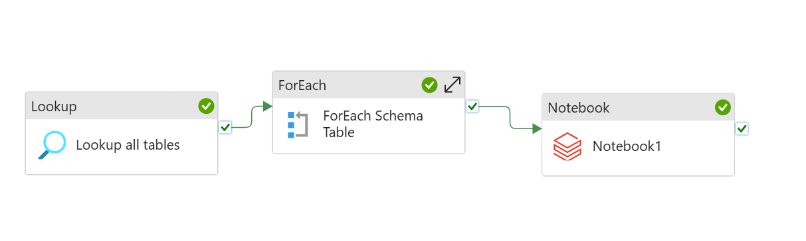

# SQL-data-pipeline
In this project, the goal was to migrate an on-premise PostgreSQL database to Microsoft Azure, leveraging various Azure services for data ingestion, transformation, and analysis. This process can be viewed as transferring data from a traditional on-premise environment to a cloud-based architecture, allowing for greater scalability and enhanced analytics capabilities.
## Data Architecture

## Steps to Migrate PostgreSQL Database to Azure
1. Create a Pipeline in Azure Data Factory (ADF):
   - Log into the Azure portal and navigate to Azure Data Factory.
   - Create a new pipeline within your ADF workspace.
2. Configure Data Source:
   - Use the Lookup Activity to retrieve table names from the on-premise PostgreSQL database.
   - Set up a Linked Service for PostgreSQL, specifying the connection details for the on-premise database.
3. Data Ingestion:
   - Add a Copy Data Activity to your pipeline to ingest data from the identified tables.
   - In the Source tab, configure the dataset that points to the PostgreSQL tables.
   - In the Sink tab, configure a dataset that points to your Azure Data Lake Storage Gen2 (ADLS Gen2) account, specifying the destination folder for storing the ingested data.
4. Run the Pipeline:
   - Trigger the pipeline to execute the ingestion process, which transfers data from the PostgreSQL database (source) to Azure Data Lake Gen2 (sink).
5. Data Transformation Using Databricks:
   - After the data is ingested, use a Databricks notebook to perform transformations on the data stored in ADLS Gen2.
   - The data is processed through multiple layers:
     - Bronze Layer: Raw data stored as-is after ingestion.
     - Silver Layer: Cleaned and enriched data after applying transformation processes.
     - Gold Layer: Aggregated and refined data, ready for analysis.
6. Store Transformed Data:
   - Store the data from each processing layer in dedicated containers within ADLS Gen2, organizing the data for efficient access and retrieval.
     
The data pipeline in Azure Data Factory is Shown below:

7. Create a Lake Database in Azure Synapse Analytics:
   - Use the data from the gold layer to create a lake database in Azure Synapse Analytics.
     
The ERD for the lake database is shown below:

## Additional Information
1. Azure Key Vault was used to Secure sensitive connection strings, credentials, and secrets used by ADF and Databricks to connect to PostgreSQL and other resources.
2. Azure Active Directory (AAD) was used to managed authentication and access control, ensuring that only authorized users and services could access Azure resources during the migration.
